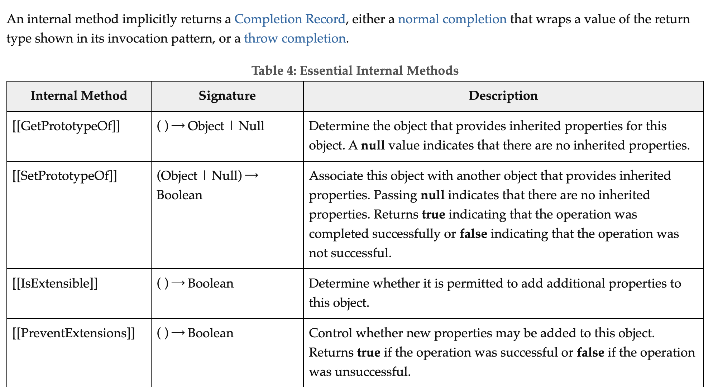

# 프로퍼티 어트리뷰트

## 내부 슬롯과 내부 메서드

자바스크립트 엔진의 구현 알고리즘을 설명하기 위해 ECMAScript 사양에서 사용하는 의사 프로퍼티와 의사 메서드를 일컫는다. ECMAScript 사양에 등장하는 이중 대괄호(\[\[...]])로 감싼 이름들이 내부 슬롯과 내부 메서드이다.\
또한 이중 대괄호로 감싼 이름들은 자바스크립트 엔진의 **내부 로직**이므로 직접 접근할 수 없다.

아래 이미지에서 Internal method 열 참고&#x20;

<figure><figcaption></figcaption></figure>

## 프로퍼티 어트리뷰트와 프로퍼티 디스크립터 객체

자바스크립트 엔진은 프로퍼티를 생성할 때 프로퍼티의 상태를 나타내는 프로퍼티 어트리뷰트를 기본값으로 자동 정의한다.

위에서 언급한 프로퍼티의 상태는 아래와같다.

- 값(value): 프로퍼티 키를 통해 프로퍼티 값에 접근하면 반환되는 값. 내부슬롯: \[\[Value]]
- 값의 갱신 가능 여부(writable): 프로퍼티 값의 변경 가능 여부. 내부슬롯: \[\[Writable]]
- 열거 가능 여부(enumerable): for...in 문이나 Object.keys 메서드 등으로 열거 가능 여부. 내부슬롯: \[\[Enumerable]]
- 재정의 가능 여부(configurable): 프로퍼티의 재정의 가능 여부. 내부슬롯: \[\[Configurable]]

프로퍼티 어트리뷰트는 자바스크립트 엔진이 관리하는 내부 상태 값(meta-property)이다. 이 프로퍼티 어트리뷰트에 직접 접근할 수는 없으나 `Object.getOwnPropertyDescriptor` 메서드를 사용하여 간접적으로 확인할 수 있다.

```js
const person = {
  name: 'Lee',
};

console.log(Object.getOwnPropertyDescriptor(person, 'name'));
// {value: "Lee", writable: true, enumerable: true, configurable: true}

// ES8에서 도입된 Object.getOwnPropertyDescriptors 메서드를 사용하면
// 모든 프로퍼티의 프로퍼티 어트리뷰트 정보를 제공하는 프로퍼티 디스크립터 객체들을 반환한다.

// 프로퍼티 동적 생성
person.age = 20;

console.log(Object.getOwnPropertyDescriptors(person));
// {
//   name: {value: "Lee", writable: true, enumerable: true, configurable: true},
//   age: {value: 20, writable: true, enumerable: true, configurable: true}
// }
```

## 데이터 프로퍼티와 접근자 프로퍼티

프로퍼티는 데이터 프로퍼티와 접근자 프로퍼티로 구분할 수 있다.

- 데이터 프로퍼티: 키와 값으로 구성된 일반적인 프로퍼티
- 접근자 프로퍼티: 자체적으로는 값을 갖지 않고 다른 데이터 프로퍼티의 값을 읽거나 저장할 때 호출되는 접근자 함수(accessor function)로 구성된 프로퍼티

### 데이터 프로퍼티

데이터 프로퍼티는 아래와같은 프로퍼티 어트리뷰트를 갖는다.

| 프로퍼티 어트리뷰트 | 설명                                                                                                                                                                                                                                    |
| ------------------- | --------------------------------------------------------------------------------------------------------------------------------------------------------------------------------------------------------------------------------------- |
| \[\[Value]]         | <p>- 프로퍼티 키를 통해 프로퍼티 값에 접근하면 반환되는 값<br>- 프로퍼티 키를 통해 프로퍼티 값을 변경하면 [[Value]]에 값을 재할당한다. 이떄 프로퍼티가 없으면 프로퍼티를 동적 생성하고 생성된 프로퍼티의 [[Value]]에 값을 저장한다.</p> |
| \[\[Writable]]      | <p>- 프로퍼티 값의 변경 가능 여부<br>- [[Writable]]의 값이 false인 경우 해당 프로퍼티의 [[Value]]의 값을 변경할 수 없는 읽기 전용 프로퍼티가 된다.</p>                                                                                  |
| \[\[Enumerable]]    | <p>- 프로퍼티의 열거 가능 여부<br>- [[Enumerable]]의 값이 false인 경우 해당 프로퍼티는 for...in 문이나 Object.keys 메서드 등으로 열거할 수 없다.</p>                                                                                    |
| \[\[Configurable]]  | <p>- 프로퍼티의 재정의 가능 여부<br>- [[Configurable]]의 값이 false인 경우 해당 프로퍼티의 삭제, 프로퍼티 어트리뷰트 값의 변경이 금지된다.</p>                                                                                          |

### 접근자 프로퍼티

접근자 프로퍼티는 자체적으로는 값을 갖지 않고 다른 데이터 프로퍼티의 값을 읽거나 저장할 때 호출되는 접근자 함수(accessor function)로 구성된 프로퍼티이다.

접근자 프로퍼티는 아래와같은 프로퍼티 어트리뷰트를 갖는다.

| 프로퍼티 어트리뷰트 | 설명                                                                                                                                                                                                                                     |
| ------------------- | ---------------------------------------------------------------------------------------------------------------------------------------------------------------------------------------------------------------------------------------- |
| \[\[Get]]           | <p>- 접근자 프로퍼티를 통해 데이터 프로퍼티의 값을 읽을 때 호출되는 접근자 함수<br>- 접근자 프로퍼티 키를 통해 접근자 프로퍼티의 값을 읽으려고 할 때 [[Get]]의 값. 즉 getter 함수가 호출되고 그 결과가 프로퍼티 값으로 반환된다.</p>     |
| \[\[Set]]           | <p>- 접근자 프로퍼티를 통해 데이터 프로퍼티의 값을 저장할 때 호출되는 접근자 함수<br>- 접근자 프로퍼티 키를 통해 접근자 프로퍼티의 값을 저장하려고 할 때 [[Set]]의 값. 즉 setter 함수가 호출되고 그 결과가 프로퍼티 값으로 저장된다.</p> |
| \[\[Enumerable]]    | - 데이터 프로퍼티의 \[\[Enumerable]]과 같다.                                                                                                                                                                                             |
| \[\[Configurable]]  | - 데이터 포로퍼티의 \[\[Configurable]]과 같다.                                                                                                                                                                                           |

접근자 프로퍼티는 getter와 setter 함수를 모두 정의할 수도 있고 하나만 정의할 수도 있다.

```js
const person = {
  // 데이터 프로퍼티
  firstName: 'Gildong',
  lastName: 'Hong',

  // fullName은 접근자 함수로 구성된 접근자 프로퍼티다.
  // getter 함수
  get fullName() {
    return `${this.firstName} ${this.lastName}`;
  },
  // setter 함수
  set fullName(name) {
    // 배열 디스트럭처링 할당
    [this.firstName, this.lastName] = name.split(' ');
  },
};

// 데이터 프로퍼티를 통한 프로퍼티 값의 참조
console.log(person.firstName + ' ' + person.lastName); // Gildong Hong

// 접근자 프로퍼티를 통한 프로퍼티 값의 저장
// 접근자 프로퍼티 fullName에 값을 저장하면 setter 함수가 호출된다.
person.fullName = 'gun Hong';
console.log(person); // {firstName: "gun", lastName: "Hong"}

// 접근자 프로퍼티를 통한 프로퍼티 값의 참조
// 접근자 프로퍼티 fullName에 접근하면 getter 함수가 호출된다.
console.log(person.fullName); // gun Hong

// firstName은 데이터 프로퍼티다.
// 데이터 프로퍼티는 [[Value]], [[Writable]], [[Enumerable]], [[Configurable]] 프로퍼티 어트리뷰트를 갖는다.
let descriptor = Object.getOwnPropertyDescriptor(person, 'firstName');
console.log(descriptor);
// {value: "gun", writable: true, enumerable: true, configurable: true}

// fullName은 접근자 프로퍼티다.
// 접근자 프로퍼티는 [[Get]], [[Set]], [[Enumerable]], [[Configurable]] 프로퍼티 어트리뷰트를 갖는다.
descriptor = Object.getOwnPropertyDescriptor(person, 'fullName');
console.log(descriptor);
// {get: ƒ, set: ƒ, enumerable: true, configurable: true}
```

## 프로퍼티 정의

프로퍼티 정의란 프로퍼티 어트리뷰트를 명시적으로 정의하는 것을 말한다. Object.defineProperty 메서드를 사용하면 프로퍼티의 어트리뷰트를 정의할 수 있다.

```js
const person = {};

// 데이터 프로퍼티 정의
Object.defineProperty(person, 'firstName', {
  value: 'Gildong',
  writable: true,
  enumerable: true,
  configurable: true,
});

Object.defineProperty(person, 'lastName', {
  value: 'Hong',
});

let descriptor = Object.getOwnPropertyDescriptor(person, 'firstName');
console.log('firstName', descriptor);
// firstName {value: "Gildong", writable: true, enumerable: true, configurable: true}

descriptor = Object.getOwnPropertyDescriptor(person, 'lastName');
console.log('lastName', descriptor);
// lastName {value: "Hong", writable: false, enumerable: false, configurable: false}

// [[Enumerable]]의 값이 false인 경우
// 해당 프로퍼티는 for...in 문이나 Object.keys 등으로 열거할 수 없다.
console.log(Object.keys(person)); // ["firstName"]

// [[Writable]]의 값이 false인 경우 해당 프로퍼티의 [[Value]]의 값을 변경할 수 없다.
// 이때 값을 변경하면 에러는 발생하지 않고 무시된다.
person.firstName = 'gun';
console.log(person); // {firstName: "gun", lastName: "Hong"}

// [[Configurable]]의 값이 false인 경우 해당 프로퍼티를 삭제할 수 없다.
// 이때 프로퍼티를 삭제하면 에러는 발생하지 않고 무시된다.
delete person.firstName;
console.log(person); // {firstName: "gun", lastName: "Hong"}

// [[Configurable]]의 값이 false인 경우 해당 프로퍼티를 재정의할 수 없다.
// 이때 프로퍼티를 재정의하면 에러가 발생한다.
Object.defineProperty(person, 'firstName', { configurable: true });
// Uncaught TypeError: Cannot redefine property: firstName
```

## 객체 변경 방지

객체는 변경 가능한 값이다. 따라서 재할당 없이 객체를 직접 수정할 수 있다. 하지만 때로는 의도치 않게 객체가 변경되는 것을 방지해야 할 때가 있다. 이때 사용하는 것이 객체 변경 방지 메서드이다. 객체 변경 방지 메서드는 아래와같다.

| 메서드                   | 설명           | 프로퍼티 추가 | 프로퍼티 삭제 | 프로퍼티 값 읽기 | 프로퍼티 값 쓰기 | 프로퍼티 어트리뷰트 재정의 |
| ------------------------ | -------------- | ------------- | ------------- | ---------------- | ---------------- | -------------------------- |
| Object.preventExtensions | 객체 확장 금지 | X             | O             | O                | O                | O                          |
| Object.seal              | 객체 밀봉      | X             | X             | O                | O                | X                          |
| Object.freeze            | 객체 동결      | X             | X             | O                | X                | X                          |

### Object.preventExtensions

Object.preventExtensions 메서드는 객체의 확장을 금지한다. 즉, 프로퍼티 추가를 금지한다. 단, 이미 존재하는 프로퍼티의 삭제는 가능하다.

```js
const person = {
  name: 'Lee',
};

// person 객체는 확장이 금지된다.
Object.preventExtensions(person);

// 프로퍼티 추가가 금지된다.
person.age = 20; // 무시. strict mode에서는 에러
console.log(person); // {name: "Lee"}

// 프로퍼티 삭제는 가능하다.
delete person.name;
console.log(person); // {}

// 프로퍼티 정의에 의한 프로퍼티 추가도 금지된다.
Object.defineProperty(person, 'age', { value: 20 });
// TypeError: Cannot define property age, object is not extensible
```

> `Object.isExtensible` 메서드로 객체의 확장 가능 여부를 확인할 수 있다.
>
> ```js
> const person = {
>   name: 'Lee',
> };
>
> // Object.isExtensible 메서드는 객체가 확장 가능한지 여부를 반환한다.
> console.log(Object.isExtensible(person)); // true
>
> // person 객체는 확장이 금지된다.
> Object.preventExtensions(person);
> console.log(Object.isExtensible(person)); // false
> ```

### Object.seal

Object.seal 메서드는 객체를 밀봉한다. 즉, 읽기와 쓰기만 가능하도록 만든다. 프로퍼티 추가 및 삭제와 재정의를 금지한다.

```js
const person = {
  name: 'Lee',
};

// person 객체는 밀봉(seal)된다.
Object.seal(person);

// person 객체는 밀봉(seal)된 객체다.
console.log(Object.isSealed(person)); // true

// 밀봉(seal)된 객체는 configurable이 false다.
console.log(Object.getOwnPropertyDescriptors(person));
// {
//   name: {value: "Lee", writable: true, enumerable: true, configurable: false}
// }

// 프로퍼티 값의 갱신은 가능하다.
person.name = 'Kim';
console.log(person); // {name: "Kim"}

// 프로퍼티 추가는 금지된다.
person.age = 20; // 무시. strict mode에서는 에러
console.log(person); // {name: "Kim"}

// 프로퍼티 정의에 의한 프로퍼티 추가도 금지된다.
Object.defineProperty(person, 'age', { value: 20 });
// TypeError: Cannot define property age, object is not extensible

// 프로퍼티 어트리뷰트 재정의도 금지된다.
Object.defineProperty(person, 'name', { configurable: true });
// TypeError: Cannot redefine property: name
```

### Object.freeze

Object.freeze 메서드는 객체를 동결한다. 즉, 읽기만 가능하도록 만든다. 프로퍼티 추가 및 삭제와 프로퍼티 어트리뷰트 재정의를 금지한다.

```js
const person = {
  name: 'Lee',
};

// person 객체를 동결한다.
Object.freeze(person);
console.log(Object.isFrozen(person)); // true

// 동결(freeze)된 객체는 writable과 configurable이 false다.
console.log(Object.getOwnPropertyDescriptors(person));
// {
//   name: {value: "Lee", writable: false, enumerable: true, configurable: false}
// }

// 프로퍼티 값의 갱신이 금지된다.
person.name = 'Kim'; // 무시. strict mode에서는 에러
console.log(person); // {name: "Lee"}

// 프로퍼티 추가가 금지된다.
person.age = 20; // 무시. strict mode에서는 에러
console.log(person); // {name: "Lee"}

// 프로퍼티 삭제가 금지된다.
delete person.name; // 무시. strict mode에서는 에러
console.log(person); // {name: "Lee"}

// 프로퍼티 정의에 의한 프로퍼티 추가 및 삭제가 금지된다.
Object.defineProperty(person, 'age', { value: 20 });
// TypeError: Cannot define property age, object is not extensible

// 프로퍼티 어트리뷰트 재정의가 금지된다.
Object.defineProperty(person, 'name', { configurable: true });
// TypeError: Cannot redefine property: name
```

### 불변 객체

변경 방지 메서드들은 얕은 변경 방지(shallow immutability)로 직속 프로퍼티만 변경이 방지되고 객체 내부의 중첩된 객체까지는 영향을 주지는 못한다. 따라서 Object.freeze 메서드로 객체를 동결하더라도 객체 내부의 중첩 객체까지 동결할 수는 없다.

```js
const person = {
  name: 'Lee',
  address: { city: 'Seoul' },
};

// 얕은 객체 동결
Object.freeze(person);

// 직속 프로퍼티만 동결한다.
console.log(Object.isFrozen(person)); // true
console.log(Object.isFrozen(person.address)); // false

// 중첩 객체까지 동결하려면 객체를 재귀적으로 순환하며 객체의 프로퍼티를 동결한다.
function deepFreeze(target) {
  // 객체가 아니거나 동결된 객체는 무시하고 객체이고 동결되지 않은 객체만 동결한다.
  if (target && typeof target === 'object' && !Object.isFrozen(target)) {
    Object.freeze(target);
    // 모든 프로퍼티를 순회하며 재귀적으로 동결한다.
    Object.keys(target).forEach((key) => deepFreeze(target[key]));
  }
  return target;
}

// 깊은 객체 동결
deepFreeze(person);

console.log(Object.isFrozen(person)); // true
console.log(Object.isFrozen(person.address)); // true

person.address.city = 'Busan';
console.log(person); // {name: "Lee", address: {city: "Seoul"}}
```
