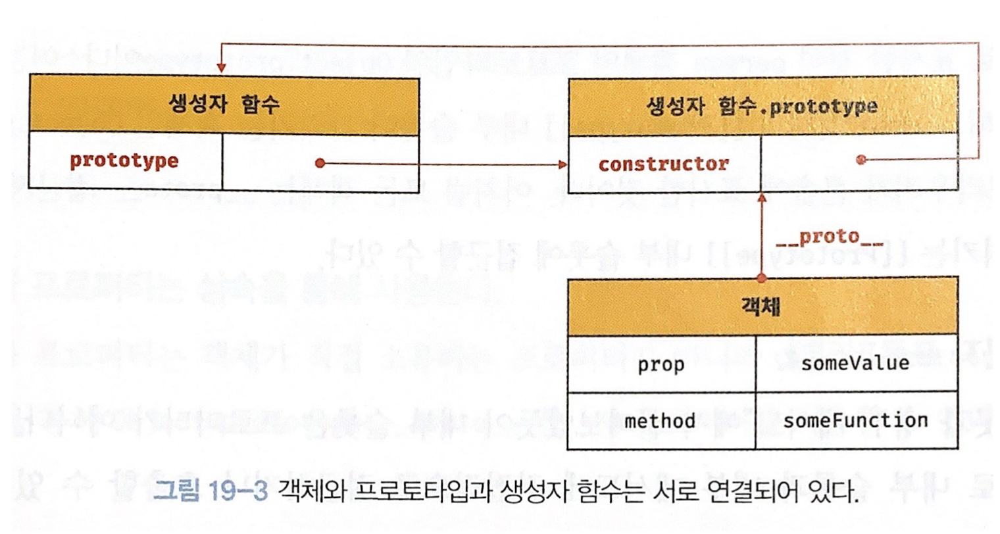
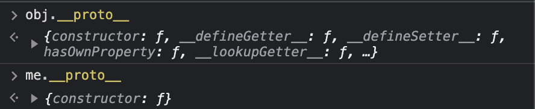

# 프로토타입

자바스크립트는 객체 기반의 프로그래밍 언어이며 자바스크립트를 이루고 있는 거의 모든 것이 객체다.
또한 명령형, 함수형, 프로토타입 기반의 객체지향 프로그래밍을 지원하는 멀티 패러다임 프로그래밍 언어이다.

## 1. 객체지향 프로그래밍

실세계의 실체를 인식하는 철학적 사고를 프로그래밍에 접목한 것이 객체지향 프로그래밍이다.  
실체는 특징이나 성질을 통해 인식하거나 구분할 수 있다.  
객체지향 프로그래밍은 실체를 인식하기 위해 객체라는 기본 단위로 분할하고, 객체의 특징과 성질을 통해 인식하거나 구분한다.
객체지향 프로그래밍의 객체는 상태를 나타내는 프로퍼티와 동작을 나타내는 메서드를 하나의 논리적인 단위로 묶은 복합적인 자료구조이다.  
각 객체는 고유의 기능을 갖는 독립적인 부품으로서 존재하면서 다른 객체와 관계성을 갖기도하고 다른 객체의 기능을 상속받아 확장을 통해 기능을 변경하거나 추가하기도 한다.

## 상속과 프로토타입

자바스크립트는 프로토타입을 기반으로 상속을 구현해 불필요한 중복을 제거한다.  
중복을 제거하는 방법은 재사용인데, 프로토타입 이전에 [생성자 함수](./생성자%20함수.md)의 예제를 먼저 살펴보자

```js
// 생성자 함수
function Circle(radius) {
  // 프로퍼티
  this.radius = radius;
  // 메서드
  this.getArea = function () {
    return Math.PI * this.radius ** 2;
  };
}

// 인스턴스 생성
const circle1 = new Circle(1);
const circle2 = new Circle(2);

// Circle 생성자 함수는 인스턴스를 생성할 때마다 동일한 동작을 하는
// getArea 메서드를 중복 생성하고 모든 인스턴스가 중복 소유한다.
// getArea 메서드는 하나만 생성하여 모든 인스턴스가 공유해서 사용하는 것이 바람직하다.
console.log(circle1.getArea === circle2.getArea); // false
```

위 예제와 아래의 프로토타입을 기반으로 상속을 구현한 것은 큰 차이가 하나있다.

```js
// 생성자 함수
function Circle(radius) {
  // 프로퍼티
  this.radius = radius;
}

// Circle 생성자 함수가 생성한 모든 인스턴스가 getArea 메서드를
// 공유해서 사용할 수 있도록 프로토타입에 추가한다.
// 프로토타입은 Circle 생성자 함수의 prototype 프로퍼티에 바인딩되어 있다.
// Circle 생성자 함수가 생성한 모든 인스턴스는 이 프로토타입을
// 자신의 부모 객체로서 가리킨다.
Circle.prototype.getArea = function () {
  return Math.PI * this.radius ** 2;
};

// 인스턴스 생성
const circle1 = new Circle(1);
const circle2 = new Circle(2);

// Circle 생성자 함수가 생성한 모든 인스턴스는 부모 객체의 역할을 하는
// 프로토타입 Circle.prototype으로부터 getArea 메서드를 상속받는다.
// 즉, Circle 생성자 함수가 생성하는 모든 인스턴스는 하나의 getArea 메서드를 공유한다.
console.log(circle1.getArea === circle2.getArea); // true
```

생성자 함수로 인스턴스를 생성할때마다 동일한 동작을 하는 메서드를 중복 생성하고 모든 인스턴스가 중복 소유하게 된다.  
반면에 위의 예제에서 프로토타입은 Circle 생성자 함수가 생성한 모든 인스턴스는 상위 객체 역할을 하는 프로토타입 Circle.prototype으로부터 getArea 메서드를 상속받는다. 즉, Circle 생성자 함수가 생성하는 모든 인스턴스는 하나의 getArea 메서드를 공유하여 사용할 수 있게 된다.

## 프로토타입 객체

프로토타입 객체는(줄여서 프로토타입) 객체지향 프로그래밍의 근안을 이루는 객체 간 상속을 구현하기 위해 사용된다.
프로토타입은 어떤 객체의 상위(부모) 객체의 역할을 하는 객체로서 다른 객체에 공유 프로퍼티나 메서드를 제공한다.

모든 객체는 [[Prototype]]이라는 내부 슬롯을 가지며, 이 내부 슬롯의 값은 프로토타입 객체를 가리킨다.  
[[Prototype]] 내부 슬롯의 값은 객체 생성 방식에 의해 결정된다. (null인 값도 있는데 이 경우 프로토타입이 없다.)  
또한 모든 객체는 하나의 프로토타입을 갖고 모든 프로토타입은 생성자 함수와 연결되어있다.



### \_\_proto\_\_ 접근자 프로퍼티

모든 객체는 \_\_proto\_\_ 접근자 프로퍼티를 통해 자신의 프로토타입, 즉 [[Prototype]] 내부 슬롯에 간접적으로 접근할 수 있다.

```js
const person = { name: "Lee" };
```


위 스크린샷은 \_\_proto\_\_ 접근자 프로퍼티를 통해 person 객체의 [[Prototype]] 내부 슬롯이 가리키는 객체인 Object.prototype에 접근한 모습이다.

#### \_\_proto\_\_는 접근자 프로퍼티다

가장 먼저 알아야할 것은 [내부 슬롯](./프로퍼티%20어트리뷰트.md)은 프로퍼티가 아니다. 즉, 자바스크립트는 원칙적으로 내부 슬롯과 내부 메서드에 직접적으로 접근하거나 호출할 수 있는 방법을 제공하지 않는다. 하지만 일부 내부 슬롯과 내부 메서드에 한해 간접적으로 접근할 수 있는 수단을 제공하기는 한다.  
[[Prototype]] 내부 슬롯에 간접적으로 접근할 수 있는 방법은 \_\_proto\_\_ 접근자 프로퍼티를 통해 가능하다.

Object.prototype의 접근자 프로퍼티인 \_\_proto\_\_는 getter, setter 함수라고 불리는 접근자 함수([[Get]], [[Set]] 프로퍼티 어트리뷰트에 할당된 함수)를 통해 [[Prototype]] 내부 슬롯의 값. 즉, 프로토타입을 취득하거나 할당한다.

```js
const obj = {};
const parent = { x: 1 };

// getter 함수인 get __proto__가 호출되어 obj 객체의 프로토타입을 취득한다.
obj.__proto__; // {constructor: ƒ, __defineGetter__: ƒ, __defineSetter__: ƒ, …}

// setter 함수인 set __proto__가 호출되어 obj 객체의 프로토타입을 교체한다.
obj.__proto__ = parent;
obj.x; // 1
```

#### \_\_proto\_\_ 접근자 프로퍼티는 상속을 통해 사용된다

\_\_proto\_\_ 접근자 프로퍼티는 객체가 직접 소유하는 프로퍼티가 아니라 Object.prototype의 프로퍼티다.

```js
const person = { name: "Lee" };

// person 객체는 __proto__ 프로퍼티를 소유하지 않는다.
console.log(person.hasOwnProperty("__proto__")); // false

// __proto__ 프로퍼티는 모든 객체의 프로토타입 객체인 Object.prototype의 접근자 프로퍼티다.
console.log(Object.getOwnPropertyDescriptor(Object.prototype, "__proto__"));
// {get: ƒ, set: ƒ, enumerable: false, configurable: true}

// 모든 객체는 Object.prototype의 접근자 프로퍼티 __proto__를 상속받아 사용할 수 있다.
console.log({}.__proto__ === Object.prototype); // true
```

> Object.prototype
>
> > 모든 객체는 프로토타입의 계층 구조인 프로토타입 체인에 묶여 있다. 자바스크립트 엔진은 객체의 프로퍼티(또는 메서드)에 접근하려고 할때 해당 객체에 접근하려는 프로퍼티가 없다면 \_\_proto\_\_ 접근자 프로퍼티가 가리키는 참조를 따라 자신의 부모 역할을 하는 프로토타입의 프로퍼티를 차례대로 검색한다. 이러한 프로토타입 체인의 종점은 Object.prototype이다.

#### \_\_proto\_\_ 접근자 프로퍼티를 통해 프로토타입에 접근하는 이유

상호 참조에 의해 프로토타입 체인이 생성되는 것을 방지하기 위해 \_\_proto\_\_ 접근자 프로퍼티를 통해 프로토타입에 접근하는 것이 권장된다.

```js
const parent = {};
const child = {};

// child의 프로토타입을 parent로 설정한다.
child.__proto__ = parent;
// parent의 프로토타입을 child로 설정한다.
parent.__proto__ = child; // TypeError: Cyclic __proto__ value
```

위 예제는 parent 객체와 child 객체의 프로토타입을 서로가 서로를 가리키도록 상호 참조하는 예제이다.
이러한 상호 참조로 인해 서로가 자신의 프로토타입이 되는 프로토타입 체인이 생성되는 것을 방지하기 위해 \_\_proto\_\_ 접근자 프로퍼티는 에러를 발생시킨다.

프로토타입 체인은 단방향 링크드 리스트로 구현되어야한다. 만약 위 예제처럼 서로가 자신의 프로토타입이 되는 순환 참조하는 프로토타입 체인이 만들어지면 프로토타입 체인 종점이 존재하지 않기 때문에 프로토타입 체인을 따라가며 프로퍼티를 검색할 때 무한 루프에 빠지게된다. 이러한 상황을 방지하기 위해 \_\_proto\_\_ 접근자 프로퍼티를 통해 프로토타입에 접근하고 교체하도록 구현되어있다.

#### \_\_proto\_\_ 접근자 프로퍼티를 코드 내에서 직접 사용하지 말자

\_\_proto\_\_ 접근자 프로퍼티는 ES5까지 ECMAScript 사양에 포함되어 있지 않았다. 하지만 일부 브라우저에서 지원하고 있었기 때문에 브라우저 호환성을 고려해 ES6에서 표준으로 채택되었다.

이를 코드 내에서 직접 사용하는 것을 권장하지 않는 이유는 모든 객체가 \_\_proto\_\_ 접근자 프로퍼티를 소유하는 것은 아니기 때문이다.

```js
const obj = Object.create(null);
console.log(obj.__proto__); // undefined
```

\_\_proto\_\_ 접근자 프로퍼티 대신 프로토 타입을 취득하거나 교체하는 ES6의 메서드인 Object.getPrototypeOf, Object.setPrototypeOf를 사용하는 것이 좋다.

```js
const obj = {};
const parent = { x: 1 };

// obj 객체의 프로토타입을 취득
Object.getPrototypeOf(obj); // obj.__proto__;
// obj 객체의 프로토타입을 교체
Object.setPrototypeOf(obj, parent); // obj.__proto__ = parent;

console.log(obj.x); // 1
```

### prototype 프로퍼티

모든 함수 객체는 prototype 프로퍼티를 소유한다.

```js
(function () {}).hasOwnProperty("prototype"); // true
```

반면에 일반 객체는 prototype 프로퍼티를 소유하지 않는다.

```js
({}).hasOwnProperty("prototype"); // false
```

prototype 프로퍼티는 생성자 함수가 생성할 인스턴스의 프로토타입을 가리킨다.
그렇기에 [non-constructor](./생성자%20함수.md)인 화살표 함수와 ES6 메서드 축약 표현으로 정의한 메서드는 prototype 프로퍼티를 소유하지 않는다.

```js
// 화살표 함수
const Person = (name) => {
  this.name = name;
};

// ES6 메서드 축약 표현
const obj = {
  foo() {},
};
```

모든 객체가 가지고 있는 다시 말해서 `Object.prototype` 으로부터 상속받은 `\_\_proto\_\_` 접근자 프로퍼티와 함수 객체만 가지고있는 prototype 프로퍼티는 모두 동일한 프로토타입을 가리킨다. 하지만 프로퍼티를 사용하는 주체가 다르다.

| 구분          | 소유        | 값                             | 사용 주체   | 사용 목적                                                       |
| ------------- | ----------- | ------------------------------ | ----------- | --------------------------------------------------------------- |
| \_\_proto\_\_ | 모든 객체   | Object.prototype 로부터의 상속 | 모든 객체   | 객체가 자신의 프로토타입에 접근 또는 교체하기 위해 사용         |
| prototype     | constructor | Object.prototype 로부터의 상속 | 생성자 함수 | 생성자 함수가 생성할 인스턴스의 프로토타입을 할당하기 위해 사용 |

예제를 통해 확인해보자

```js
// 생성자 함수
function Person(name) {
  this.name = name;
}

const me = new Person("Lee");

// Person.prototype과 me.__proto__는 동일한 프로토타입을 가리킨다.
console.log(Person.prototype === me.__proto__); // true
```

### constructor 프로퍼티

`constructor` 프로퍼티는 모든 프로토타입이 가지고 있는 프로퍼티다. 또한 이 constructor 프로퍼티는 자신을 참조하고 있는 생성자 함수를 가리킨다.

```js
// 생성자 함수
function Person(name) {
  this.name = name;
}

const me = new Person("Lee");

// me 객체의 생성자 함수는 Person이다.
console.log(me.constructor === Person); // true
```

위 예제에서 me 객체는 `Person`의 `prototype`이 가지고있는 constructor 프로퍼티를 통해 생성자 함수인 `Person`을 참조할 수 있다.  
me 객체에는 직접적으로 `constructor` 프로퍼티를 가지고 있지않지만 `Person.prototype`이 가지고있는 `constructor` 프로퍼티를 상속받아 사용할 수 있다.

## 리터럴 표기법에 의해 생성된 객체의 생성자 함수와 프로토타입

위에서 살펴본 것처럼 생성자 함수로 생성한 객체가 아니라 객체 리터럴 표기법으로 생성된 객체도 프로토타입을 가지고있다.

```js
const obj = {};

console.log(obj.constructor === Object); // true
```

위 예제에서 obj 객체는 객체 리터럴 표기법으로 생성되었지만 Object 생성자 함수와 constructor 프로퍼티로 연결되어있다.  
이러한 점에서 객체 리터럴을 통해 생성된 객체도 Object 생성자 함수가 생성한 객체와 같다고 착각할 수 있다.  
ECMAScript 사양에서는 Object 생성자 함수는 다음과 같이 정의되어있다.


참고: <https://tc39.es/ecma262/#sec-fundamental-objects>

위 사양을 살펴보면 Object 생성자 함수에 인수를 전달하지않거나 undefined, null을 전달하면서 호출하면 내부적으로 추상 연산 OrdinaryObjectCreate를 호출해 Object.prototype을 프로토타입으로 갖는 빈 객체를 생성한다.

> 추상 연산
>
> > ECMAScript 사양에서 내부 동작의 구현 알고리즘을 표현한 것이다. 설명을 위해 사용되는 함수같은 의사 코드로 이해하면 편하다.

```js
// 인수가 전달되지 않았을 때 추상 연산 OrdinaryObjectCreate를 호출하여 빈 객체를 생성한다.
const obj = new Object();

// new.target이 undefined나 Object가 아닌 경우
// 인스턴스 -> Foo.prototype -> Object.prototype 순으로 프로토타입 체인이 생성된다.
class Foo extends Object {}
new Foo();

// 인수가 전달된 경우에는 인수를 객체로 변환한다.
obj = new Object(123);
console.log(obj); // Number {123}

obj = new Object("123");
console.log(obj); // String {"123"}
```

객체 리터럴이 평가될 때는 아래의 이미지와같이 추상 연산 OrdinaryObjectCreate를 호출하여 빈 객체를 생성하고 프로퍼티를 추가하도록 정의되어있다.


Object 생성자 함수 호출과 객체 리터럴의 평가는 추상 연산 OrdinaryObjectCreate를 호출하여 빈 객체를 생성하는 점은 동일하지만 new.target의 확인이나 프로퍼티를 추가하는 처리 등 세부 내용은 다르다.  
즉, 객체 리터럴에 의해 생성된 객체는 Object 생성자 함수가 생성한 객체가 아니다.

리터럴 표기법에 의해 생성된 객체도 상속을 위해 프로토타입이 필요하다. 그렇기에 리터럴 표기법에 의해 생성된 객체도 가상적인 생성자 함수를 갖는다.
프로토타입은 생성자 함수와 더불어 생성되며 prototype, constructor 프로퍼티에 의해 연결되어 있다.  
즉, 프로토타입과 생성자 함수는 언제나 쌍으로 존재한다는 것이다.

리터럴 표기법에 의해 생성된 객체는 생성자 함수에 의해 생성된 객체는 아니지만 생성자 함수로 생성한 객체와 큰 차이가 없다.  
위에서 살펴본 예제에서 obj 객체는 Object 생성자 함수가 생성한 객체는 생성 과정에 약간의 차이는 있지만 동일하게 동작한다. 또한 함수 리터럴에 의해 생성한 함수와 Function 생성자 함수가 생성한 함수는 생성 과정과 스코프, 클로저 등의 차이가 있지만 함수로서 동일한 특성을 갖는다.

## 프로토타입의 생성 시점

위에서 살펴보았듯이 객체는 리터럴 표기법이나 생성자 함수에 의해 생성되므로 모든 객체는 생성자 함수와 연결되어 있다는 것을 알 수 있다.

> Object.create 메서드와 클래스로 객체를 생성하는 방법도 있다. 이 부분은 나중에 살펴보자

그렇다면 프로토타입은 언제 생성되는 것일까?  
프로토타입은 생성자 함수가 생성되는 시점에 더불어 생성된다.  
생성자 함수는 사용자 정의 생성자 함수와 빌트인 생성자 함수를 구분할 수 있다. 이를 토대로 프로토타입의 생성 시점을 알아보자

### 사용자 정의 생성자 함수와 프로토타입 생성 시점

내부 메서드 [[Construct]]를 갖는 함수 객체, 즉 일반 함수(화살표 함수나 ES6의 메서드 축약 표현으로 정의한 메서드는 제외)는 new 연산자와 함께 생성자 함수로 사용할 수 있다.  
이러한 생성자 함수로 호출할 수 있는 함수. 즉 constructor는 함수 정의가 평가되어 함수 객체를 생성하는 시점에 프로토타입도 더불어 생성된다.

```js
// 함수 정의(constructor)가 평가되어 함수 객체를 생성하는 시점에 프로토타입도 더불어 생성된다.
console.log(Person.prototype); // {constructor: ƒ}

function Person(name) {
  this.name = name;
}
```

반면에 생성자 함수로서 호출할 수 없는 함수. 즉 non-constructor는 프로토타입은 생성되지 않는다.

```js
// 화살표 함수는 non-constructor다.
const Person = (name) => {
  this.name = name;
};

// non-constructor는 프로토타입이 생성되지 않는다.
console.log(Person.prototype); // undefined
```

위의 예제에서 생성된 Person.prototype은 constructor 프로퍼티만을 갖는 객체다. 프로토타입도 객체이고 모든 객체는 프로토타입을 가지므로 프로토타입도 자신의 프로토타입을 갖는다. 여기서 생성된 프로토타입은 Object.prototype 이다.

```js
// Person.prototype의 프로토타입은 Object.prototype이다.
console.log(Person.prototype.__proto__ === Object.prototype); // true
```

### 빌트인 생성자 함수와 프로토타입 생성 시점

Object, String, Number, Boolean, Promise, Function, Array, Date, RegExp 등의 빌트인 생성자 함수는 전역 객체가 생성되는 시점에 더불어 프로토타입도 생성된다. 생성된 프로토타입은 빌트인 생성자 함수의 prototype 프로퍼티에 바인딩된다.  
전역 객체(클라이언트 사이드라면 window)는 표준 빌트인 객체와 환경에 따른 호스트 객체를 프로퍼티로 갖는다.  
즉, 전역 객체가 생성되며 생성자 함수와 프로토타입은 이미 객체화되어 존재한다. 이후 생성자 함수 또는 리터럴 표기법으로 객체를 생성하면 프로토타입은 생성된 객체의 [[Prototype]] 내부 슬롯에 할당된다. 생성된 객체는 프로토타입을 상속받는다.

## 객체 생성 방식과 프로토타입의 결정

객체는 다음과 같은 방식으로 생성할 수 있다.

- 객체 리터럴
- Object 생성자 함수
- 생성자 함수
- Object.create 메서드
- 클래스(ES6)

각 생성 방식마다 차이는 있으나 추상 연산 `OrdinaryObjectCreate` 에 의해 생성된다는 점은 동일하다.

추상 연산 `OrdinaryObjectCreate` 는 빈 객체를 생성한 후, 객체에 추가할 프로퍼티 목록이 인수로 전달된 경우 프로퍼티를 객체에 추가한다. 인수로 전달받은 프로토타입을 생성한 객체의 [[Prototype]] 내부 슬롯에 할당한 뒤, 생성한 객체를 반환한다.  
즉, 프로토타입은 추상 연산 `OrdinaryObjectCreate` 에 전달되는 인수에 의해 결정된다. 이 인수는 객체가 생성되는 시점에 각 객체 생성 방식에 의해서 결정된다.

### 객체 리터럴에 의해 생성된 객체의 프로토타입

객체 리터럴을 평가하여 객체를 생성할 때 `OrdinaryObjectCreate` 이 호출되는데, 이때 추상 연산 `OrdinaryObjectCreate`에 전달되는 프로토타입은 `Object.prototype` 이다.  
즉, 객체 리터럴에 의해 생성된 객체의 프로토타입은 `Object.prototype` 이다.

```js
const obj = { x: 1 };

// obj 객체의 프로토타입은 Object.prototype이다.
console.log(Object.getPrototypeOf(obj) === Object.prototype); // true

// obj 객체의 프로토타입의 constructor는 Object이다.
console.log(obj.__proto__.constructor === Object); // true

// obj 객체의 constructor도 Object이다.
console.log(obj.constructor === Object); // true

// 위 코드는 아래 코드와 동일한 내용이기 때문이다.
console.log(Object.prototype.constructor === Object); // true
```

### Object 생성자 함수에 의해 생성된 객체의 프로토타입

Object 생성자 함수를 호출하여 객체를 생성할 때 추상 연산 `OrdinaryObjectCreate` 가 호출되고 이때 인수로 전달되는 객체는 `Object.prototype` 이다. 즉, 바로 위에서 이야기했듯 Object 생성자 함수에 의해 생성된 객체의 프로토타입은 `Object.prototype` 이다.

```js
const obj = new Object();
obj.x = 1;

// Object 생성자 함수에 의해 생성된 obj 객체의 프로토타입은 Object.prototype을 상속받는다.
console.log(obj.constructor === Object); // true
console.log(Object.getPrototypeOf(obj) === Object.prototype); // true
```

객체 리터럴과 Object 생성자 함수에 의한 객체 생성 방식의 차이는 프로퍼티를 추가하는 방식에 있다. 객체 리터럴은 리터럴 내부에 추가하면 되지만 Object 생성자 함수 방식은 생성된 객체를 가리키는 식별자를 통해 프로퍼티를 추가해야한다.

### 생성자 함수에 의해 생성된 객체의 프로토타입

new 연산자와 함께 생성자 함수를 호출하여 인스턴스를 생성하면 다른 객체 생성 방식과 동일하게 추상 연산 `OrdinaryObjectCreate` 가 호출된다. 이때 추상 연산 `OrdinaryObjectCreate`에 전달되는 프로토타입은 생성자 함수의 `prototype` 프로퍼티에 바인딩된 객체다.

```js
function Person(name) {
  this.name = name;
}

const me = new Person("Lee");

// Person 생성자 함수에 의해 생성된 me 객체의 프로토타입은 Person.prototype이다.
console.log(Object.getPrototypeOf(me) === Person.prototype); // true
```

표준 빌트인 객체인 Object 생성자 함수와 같이 생성된 프로토타입 `Object.prototype` 은 다양한 메서드(hasOwnProperty, toString, valueOf 등)를 제공한다. 반면에 사용자 정의 사용자 함수의 프로토타입의 프로퍼티는 `constructor` 프로퍼티 하나뿐이다.



## 프로토타입 체인

```js
function Person(name) {
  this.name = name;
}

Person.prototype.sayHello = function () {
  console.log(`Hi! My name is ${this.name}`);
};

const me = new Person("Lee");

// hasOwnProperty 메서드는 Object.prototype의 메서드다.
console.log(me.hasOwnProperty("name")); // true
```

me 객체의 프로토타입은 `Person.prototype` 이다.

```js
console.log(me.__proto__ === Person.prototype); // true
```

그러나 me 객체에서 `Object.prototype` 의 메서드인 `hasOwnProperty` 를 호출할 수 있다. 이것을 다시 말하면 me 객체는 `Person.prototype` 뿐만 아니라 `Object.prototype` 도 상속받았다는 것이다.

모든 객체는 prototype을 가지고 있다. `Person.prototype` 도 객체이므로 프로토타입을 가지고있다.  
프로토타입의 프로토타입은 `Object.prototype` 이다.

```js
console.log(Person.prototype.__proto__ === Object.prototype); // true
```

자바스크립트는 객체의 프로퍼티에 접근하려고 할 때 해당 객체에 접근하려는 프로퍼티가 없다면 `[[Prototype]]` 내부 슬롯의 참조를 따라 부모 역할을 하는 프로토타입의 프로퍼티를 순차적으로 검색한다. 이를 프로토타입 체인이라고 한다. 프로토타입 체인은 자바스크립트가 객체지향 프로그래밍의 상속을 구현하는 메커니즘이다.

위의 예제에서 me 객체가 `hasOwnProperty` 메서드를 호출하면 me 객체에는 `hasOwnProperty` 메서드가 없다. 이때 me 객체의 프로토타입인 `Person.prototype`에서 `hasOwnProperty` 메서드를 검색한다. `Person.prototype`에도 `hasOwnProperty` 메서드가 없다면 `Person.prototype`의 프로토타입인 `Object.prototype`에서 `hasOwnProperty` 메서드를 검색한다. 이처럼 프로토타입 체인은 `Object.prototype` 의 프로토타입인 null에 이를 때까지 이어진다.

Object.prototype을 프로토타입의 종점(end of prototype chain)이라고 한다. Object.prototype의 프로토타입. 즉, [[Prototype]] 내부 슬롯의 값은 null이다. Object.prototype 에서도 프로퍼티를 검색할 수 없다면 프로토타입 체인의 종점에 이르렀으므로 프로퍼티가 존재하지 않는다는 것을 의미한다. 이때 undefined를 반환한다. (에러가 발생하지 않는다.)

```js
console.log(me.foo); // undefined
```

> 스코프 체인과 프로토타입 체인의 관계
>
> > 스코프 체인은 식별자 검색을 위한 매커니즘이고 프로토타입 체인은 상속과 프로퍼티 검색을 위한 메커니즘이다.
> >
> > ```js
> > me.hasOwnProperty("name");
> > ```
> >
> > 위 예제에서는 먼저 스코프 체인에서 me 식별자를 검색한다. me 식별자는 전역에서 선언되었으므로 전역 스코프에서 검색된다. 그 후 me 객체의 프로토타입 체인에서 hasOwnProperty 메서드를 검색한다. 이처럼 스코프 체인과 프로토타입 체인은 서로 연관없이 별도로 동작하는 것이 아니라 서로 협력하여 식별자와 프로퍼티를 검색한다.

## 오버라이딩과 프로퍼티 섀도잉

객체는 프로토타입 체인으로 연결되어 있기 때문에 같은 이름의 프로퍼티가 여러 객체에 중복해서 존재할 수 있다. 이때 프로퍼티가 중복되면 프로퍼티의 값은 프로토타입 체인의 순회 과정에서 가장 먼저 발견한 프로퍼티의 값으로 결정된다. 여기서 프로토타입의 프로퍼티와 같은 이름의 프로퍼티를 인스턴스에 추가하면 인스턴스 프로퍼티로 추가가 되는데, 이때 프로토타입 체인을 통해 프로토타입의 프로퍼티이 아니라 인스턴스 프로퍼티가 검색되어 사용된다. 이렇게 프로토타입 프로퍼티가 가려지는 현상을 프로퍼티 섀도잉이라고 한다.

```js
const Person = function (name) {
  this.name = name;
};

Person.prototype.sayHello = function () {
  console.log(`Hi! My name is ${this.name}`);
};

const me = new Person("Lee");

me.sayHello = function () {
  console.log(`Hey! My name is ${this.name}, Nice to meet you!`);
};

me.sayHello(); // Hey! My name is Lee, Nice to meet you!
```

위 예제에서 me 객체의 sayHello 메서드는 프로토타입 체인을 통해 검색된다. 하지만 me 객체에 sayHello 메서드가 존재하므로 프로토타입 체인을 통해 프로토타입의 sayHello 메서드가 검색되지 않는다. 여기서 인스턴스(me) 메서드 sayHello는 프로토타입 메서드 sayHello를 `오버라이딩(overriding)` 했다고 말한다.

> 오버라이딩(overriding)
>
> > 상위 클래스로부터 상속받은 메서드를 하위 클래스가 재정의하여 사용하는 방식

> 오버로딩(overloading)
>
> > 함수의 이름은 동일하지만 매개변수의 타입 또는 개수가 다른 메서드를 구현하고 매개변수에 의해 메서드를 구별하여 호출하는 방식  
> > 자바스크립트는 매개변수의 타입이나 개수를 체크하지 않기 때문에 오버로딩이 지원되지 않는다. 다만, arguments 객체를 사용하여 구현할 수는 있다.

```js
delete me.sayHello;
me.sayHello(); // Hi! My name is Lee
```

delete 연산자를 사용하여 me 객체의 인스턴스 프로퍼티인 sayHello 메서드를 삭제하면 프로토타입 체인을 통해 프로토타입의 sayHello 메서드가 검색되어 호출된다. 여기서 한 번 더 delete를 시도하면 아래의 예제처럼 동작한다.

```js
// 프로토타입 체인을 통해 프로토타입 메서드는 삭제되지않는다.
delete me.sayHello;
me.sayHello(); // Hi! My name is Lee
```

위 예제처럼 하위 객체를 통해 프로토타입의 프로퍼티를 변경하거나 삭제할 수 없다. 이는 get은 허용되나 set은 허용되지 않는다. 만약 변경을 하고 싶다면 직접 프로토타입에 접근해야한다.

```js
// 프로토타입의 프로퍼티를 변경하려면 직접 프로토타입에 접근해야한다.
delete me.__proto__.sayHello; // or delete Person.prototype.sayHello;
me.sayHello(); // TypeError: me.sayHello is not a function
```
